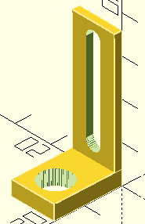

Provides a support for a free wheel (fixed by a unique axis)
which height can be tuned using a buttonhole.

# Parameters

* shift -- number (in standard hole number of the buttonhole.
* axis -- free wheel fixing axis diameter.
* support_thickess -- thickness of the part supporting the free wheel.
