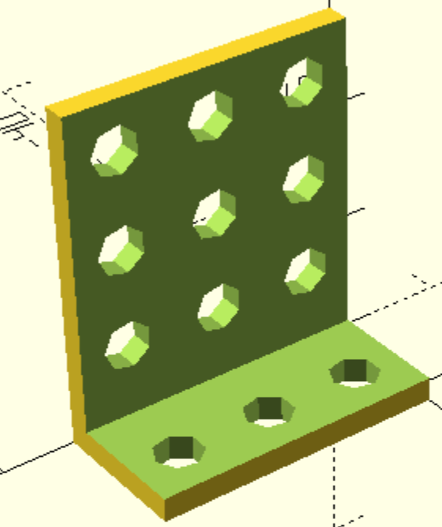

Provides an holey angle piece with additional space at the angle edge.

# Parameters

* height -- height in hole of the vertical part.
* width -- width in hole along the edge.
* depth -- depth in hole of the horizontal part.
